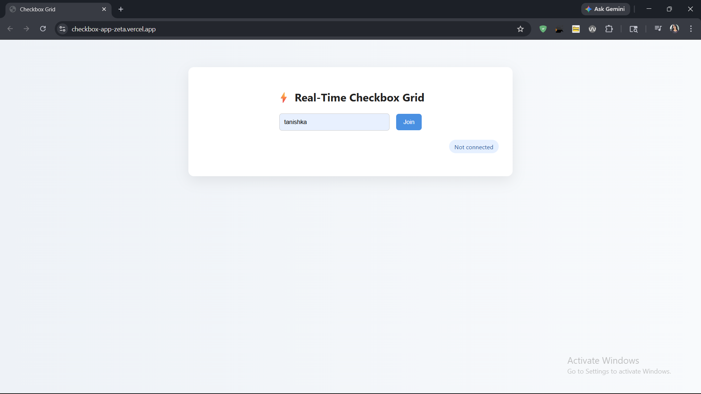
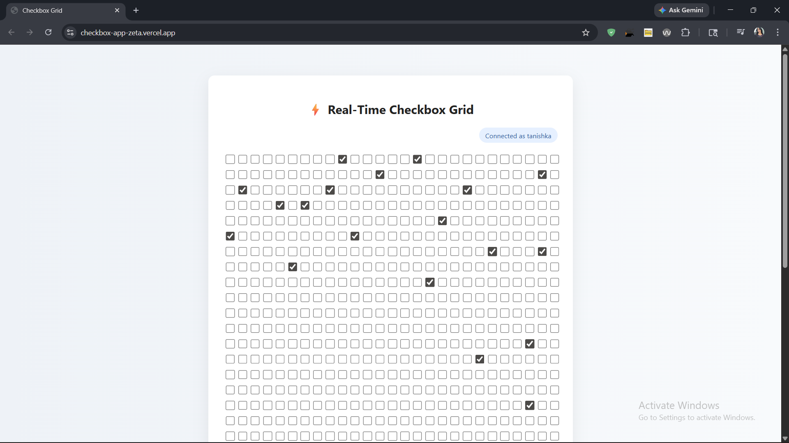
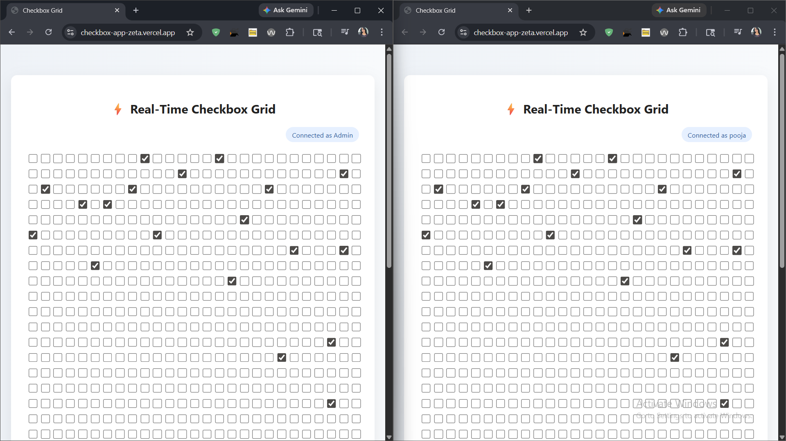

# ⚡ Real-Time Checkbox Grid

🔗 **Live Demo:** https://checkbox-app-zeta.vercel.app/


---

## 🧠 Overview

A real-time web application where multiple users can interact with a shared grid of checkboxes.

When one user toggles a checkbox, the update is instantly reflected for all connected users using WebSockets.

The system uses Redis for efficient state management and Pub/Sub for broadcasting updates across clients.

---

## 🚀 Tech Stack

* **Frontend:** HTML, CSS, JavaScript
* **Backend:** Node.js, Express
* **Realtime:** WebSockets (ws)
* **Database / Coordination:** Redis (Upstash)
* **Authentication:** JWT

---

## ✨ Features

* 🔄 Real-time checkbox sync across users
* ⚡ WebSocket-based communication
* 🧠 Efficient state storage using Redis BIT operations
* 📡 Redis Pub/Sub for update broadcasting
* 🔐 Simple JWT-based login system
* 🚫 Custom rate limiting (no external libraries used)
* ⏳ Cooldown system (5 seconds after rapid clicks)
* 🔔 Toast notifications for user feedback
* 👤 “Connected as [username]” badge

---

## ⚙️ How It Works

### 1. Authentication

* User enters a username
* Server generates a JWT token
* Token is used to authenticate WebSocket connection

---

### 2. Checkbox State Storage

* Stored using Redis `SETBIT` and `GETBIT`
* Efficient for handling large grids (1000+ checkboxes)

---

### 3. Real-Time Flow

1. User clicks checkbox
2. WebSocket sends event to server
3. Server updates Redis
4. Redis Pub/Sub broadcasts update
5. All clients update instantly

---

### 4. Rate Limiting

Custom-built using Redis:

* Allows **4 clicks within 2 seconds**
* On exceeding:

  * ❌ Clicking is blocked
  * ⏳ 5-second cooldown enforced
  * 🔔 Popup message shown

---

## 🖥️ Run Locally

### 1. Clone repository

```bash
git clone https://github.com/your-username/checkbox-app.git
cd checkbox-app
```

---

### 2. Install dependencies

```bash
npm install
```

---

### 3. Setup environment variables

Create `.env` file:

```env
PORT=3000
REDIS_URL=your_upstash_redis_url
```

---

### 4. Start backend server

```bash
node server/server.js
```

---

### 5. Start frontend

```bash
cd client
npx serve -l 5000
```

Open in browser:

```
http://localhost:5000
```

---

## 📁 Project Structure

```
checkbox-app/
│
├── server/
│   ├── server.js
│   ├── redis.js
│   ├── rateLimiter.js
│
├── client/
│   ├── index.html
│   ├── script.js
│   ├── style.css
│
├── .env
└── README.md
```

---
## 📸 Screenshots

### Login Screen


### Checkbox Grid


### Real time check



## 📌 Highlights

* Real-time multi-user interaction
* Efficient bit-level storage in Redis
* Custom-built rate limiting logic
* Clean WebSocket + Redis Pub/Sub architecture

---
Built by Tanishka Rathi
---

